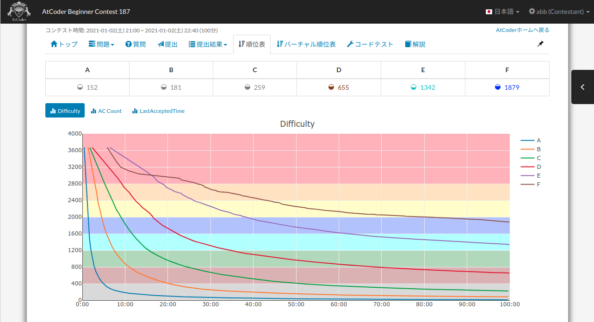
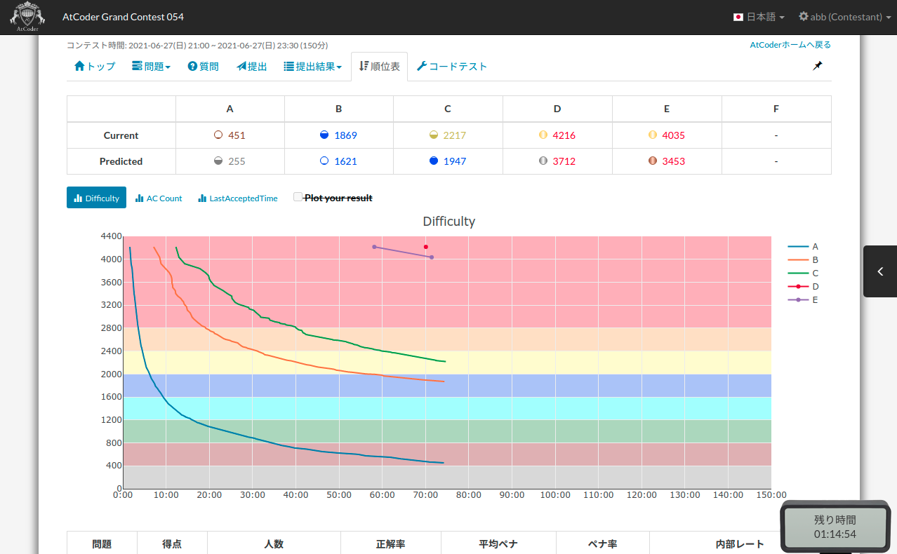

atcoder-standings-difficulty-analyzer
=====

## 概要

AtCoder の順位表ページに，コンテスト中の Difficulty 推移を表示する userscript です．

コンテスト中は，現時点の Difficulty と，最終的な Difficulty の推定値を表示します．

## 機能

- 問題ごとの Difficulty 推定値の表示
- 以下のグラフを表示
  - Difficulty の推移
  - AC 数の推移
  - 得点ごとの Last Accepted Time 統計
    - 元ネタ: [https://twitter.com/yuta_game_music/status/1299708740216582145](https://twitter.com/yuta_game_music/status/1299708740216582145)

## Greasy Fork 配布ページ

- [atcoder\-standings\-difficulty\-analyzer](https://greasyfork.org/ja/scripts/419541-atcoder-standings-difficulty-analyzer)

## 使用方法

Tampermonkey 等で読み込んで使用してください．

## 更新履歴

- 2021.1.2.0
  - 初版
- 2021.1.4.0
  - 満点のみを AC として扱い，部分点を AC 扱いしないように変更
    - [れたすさんはTwitterを使っています 「@iiljj これってもしかして部分点取ったら AC 扱いですか？（AGC047\-E の diff 推定がかなり低くなっていたので……）」 / Twitter](https://twitter.com/fairly_lettuce/status/1346012242555281409)
- 2021.1.8.0
  - ログイン中のユーザの結果をプロットする機能を追加
  - ほか不具合修正
- 2021.1.9.0
  - AC Count Chart の対数軸プロット機能を追加
  - 有志コンなど Unrated コンテストで正常に動作しなかった不具合を修正
  - グラフの時間方向軸の刻み幅を最適化
  - 初参加者/チーム参加者にデフォルト内部レートを割り当てるよう変更
  - ユーザ検索時などデータの更新がないときに再描画が走らないように変更
- 2021.4.30.0
  - Difficulty テーブルを20問ごとに改行するように変更
    - [競プロ典型 90 問 \- AtCoder](https://atcoder.jp/contests/typical90) で横 1 列に 90 問が並ぶのを回避するため
- 2021.4.30.1
  - Plot your result 有効時，Difficulty テーブル内の AC 済み問題の背景を緑で塗るように変更
    - これに伴い，チェックマーク（✓）の表示は廃止
- 2021.6.27.0
  - コンテスト中，現時点の Difficulty だけでなく，最終的な Difficulty の推定値も表示する機能を追加
- 2021.8.0
  - 開発環境を TypeScript へ移行
- 2021.8.1
  - 有志コンの difficulty 推定が正しく動いていなかった問題を修正
    - [NatsubiSoganさんはTwitterを使っています 「Difficulty を推定するスクリプト、有志コンで壊れてない？」 / Twitter](https://twitter.com/NatsubiSogan/status/1426089763887480836)
  - チーム順位表が提供されているコンテストで個人単位の順位表を開いている場合，より difficulty 推定値が正しいチーム順位表へ誘導するためのアラートを追加
- 2021.9.0
  - テーブルに表示される difficulty 400 未満の推定値が誤っていた問題を修正（グラフは以前から正しい）
